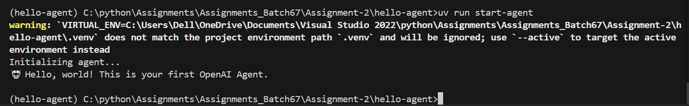

# 🤖 Hello Agent – Assignment 02

This is a basic OpenAI Agent built using the OpenAI Agent SDK and UV package manager.

---

## 🚀 How to Run

1. Clone this repo and `cd` into it.
2. Create a `.env` file:
    ```
    OPENAI_API_KEY=your-key-here
    ```
3. Install dependencies and run:
    ```bash
    uv venv
    uv pip install -r requirements.txt
    uv run start-agent
    ```

---

## 🖼️ Screenshot



🤖 Hello, world! This is your first OpenAI Agent.

yaml
Copy
Edit

---

## 📁 Project Structure

hello-agent/
├── .env
├── pyproject.toml
├── README.md
├── requirements.txt
├── src/
│ └── hello_agent/
│ ├── init.py
│ └── agent_hello.py

yaml
Copy
Edit

---

## 🧠 Notes

- API key is stored securely using `.env`
- Uses `uv run` script for execution
- Built with best practices for packaging and environment management